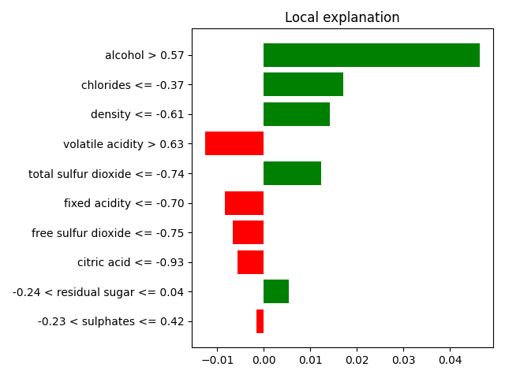
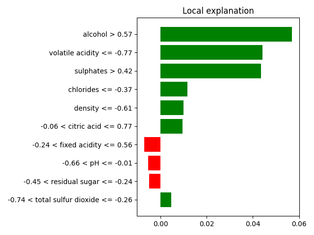

# Explainable Wine Quality with LIME

Aplicação de **LIME (Local Interpretable Model-agnostic Explanations)** para explicar predições individuais de modelos de Machine Learning treinados no dataset de qualidade de vinho tinto.

> Projeto desenvolvido sob orientação do Prof. Dr. E. Kapetanios (PhD, ETH Zurich).

---

## Visão Geral

Modelos de ML de alta performance (como Random Forest e AdaBoost) costumam ser "caixas-pretas" — difíceis de interpretar. Este projeto usa o LIME para gerar explicações locais e legíveis por humanos sobre *por que* um modelo classificou um vinho como de boa ou má qualidade.

---

## Dataset

**Red Wine Quality** — UCI Machine Learning Repository
1.599 amostras de vinho tinto com 11 atributos físico-químicos e uma nota de qualidade (0–10).

| Atributo                | Tipo   |
|-------------------------|--------|
| fixed acidity           | float  |
| volatile acidity        | float  |
| citric acid             | float  |
| residual sugar          | float  |
| chlorides               | float  |
| free sulfur dioxide     | float  |
| total sulfur dioxide    | float  |
| density                 | float  |
| pH                      | float  |
| sulphates               | float  |
| alcohol                 | float  |
| quality *(target)*      | int    |

O target é binarizado: `goodquality = 1` se `quality >= 7`, caso contrário `0`.

---

## Modelos Treinados

| Modelo               | Acurácia |
|----------------------|----------|
| Decision Tree        | 89%      |
| **Random Forest**    | **92%**  |
| AdaBoost             | 89%      |

O **Random Forest** foi selecionado como modelo principal para as explicações LIME.

---

## Como Funciona o LIME

O LIME gera uma explicação local para uma predição específica ao:

1. Criar perturbações em torno da amostra de interesse.
2. Treinar um modelo linear simples (interpretável) nessas perturbações.
3. Usar os pesos do modelo linear como a explicação — quais features mais influenciaram a predição.

---

## Exemplos de Explicação

### Predição: baixa qualidade (índice 20)



### Predição: alta qualidade (índice 2)



---

## Instalação

```bash
pip install -r requirements.txt
```

---

## Uso

```bash
python main.py
```

Certifique-se de que o arquivo `winequality-red.csv` esteja no mesmo diretório.

---

## Estrutura do Projeto

```text
explainable-wine-quality-lime/
├── main.py                 # Ponto de entrada — orquestra treino e explicações
├── training.py             # Carregamento, pré-processamento e treinamento dos modelos
├── explanation.py          # Construção do explainer LIME e geração dos gráficos
├── requirements.txt        # Dependências com versões pinadas
├── winequality-red.csv     # Dataset
├── output_32_0.png         # Explicação LIME - baixa qualidade
├── output_36_0.png         # Explicação LIME - alta qualidade
└── README.md
```

---

## Referências

- [LIME — GitHub](https://github.com/marcotcr/lime)
- [Red Wine Quality Dataset — UCI](https://archive.ics.uci.edu/ml/datasets/wine+quality)
